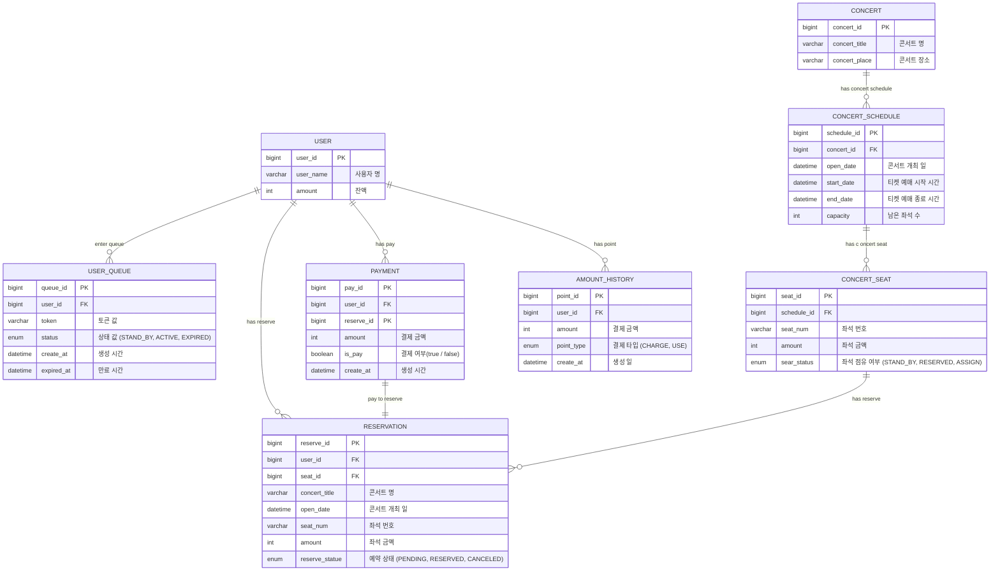

**[ ERD ]**

* 사용자는 대기열을 여러건 생성 가능합니다. (대기열 만료 상태 ENUM 관리)
* 콘서트에는 콘서트 스케줄이 여러건 존재합니다. 
* 콘서트 스케줄 당 여러개의 좌석이 존재합니다.
* 콘서트 좌석 당 여러건의 예약이 존재합니다.
* 사용자는 콘서트를 여러건 예약 할 수 있습니다. 
* 사용자는 콘서트 예약를 확정하기 위해 좌석을 결제합니다. 
* 사용자에게는 결제 내역이 여러건 존재합니다.
* 사용자가 결제를 완료 하면 예약이 확정됩니다.
* 사용자가 결제를 완료하지 않으면 예약이 취소됩니다.
* 사용자는 충전, 사용 내역을 여러건 관리합니다.