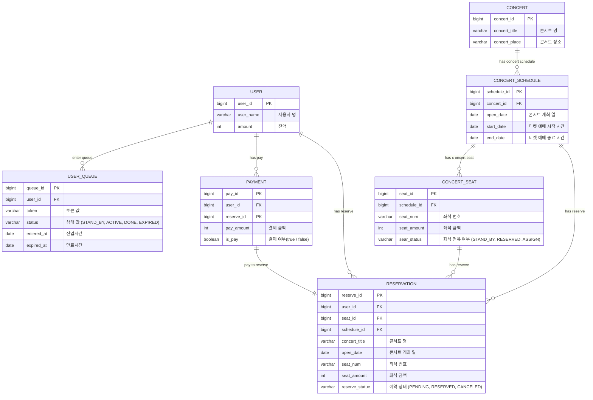

**[ ERD ]**

```mermaid
erDiagram
    USER {
        bigint user_id PK
        varchar user_name "사용자 명"
        int amount "잔액"
    }
    USER_QUEUE {
        bigint queue_id PK
        bigint user_id FK
        varchar token "토큰 값"
        varchar status "상태 값 (STAND_BY, ACTIVE, DONE, EXPIRED)"
        date entered_at "진입시간"
        date expired_at "만료시간"
    }
    CONCERT {
        bigint concert_id PK
        varchar concert_title "콘서트 명"
        varchar concert_place "콘서트 장소"
    }
    CONCERT_SCHEDULE {
        bigint schedule_id PK
        bigint concert_id FK
        date open_date "콘서트 개최 일"
        date start_date "티켓 예매 시작 시간"
        date end_date "티켓 예매 종료 시간"
    }
    CONCERT_SEAT {
        bigint seat_id PK
        bigint schedule_id FK
        varchar seat_num "좌석 번호"
        int seat_amount "좌석 금액"
        varchar sear_status "좌석 점유 여부 (STAND_BY, RESERVED, ASSIGN)"
    }
    PAYMENT {
        bigint pay_id PK
        bigint user_id FK
        bigint reserve_id PK
        int pay_amount "결제 금액"
        boolean is_pay "결제 여부(true / false)"
    }
    RESERVATION {
        bigint reserve_id PK
        bigint user_id FK
        bigint seat_id FK
        bigint schedule_id FK
        varchar concert_title "콘서트 명"
        date open_date "콘서트 개최 일"
        varchar seat_num "좌석 번호"
        int seat_amount "좌석 금액"
        varchar reserve_statue "예약 상태 (PENDING, RESERVED, CANCELED)"
    }
	USER ||--o{ USER_QUEUE : "enter queue"
    USER ||--o{ PAYMENT : "has pay"
    USER ||--o{ RESERVATION : "has reserve"
    CONCERT ||--o{ CONCERT_SCHEDULE : "has concert schedule"
    CONCERT_SCHEDULE ||--o{ CONCERT_SEAT : "has c oncert seat"
    CONCERT_SCHEDULE ||--o{ RESERVATION : "has reserve"
    PAYMENT ||--|| RESERVATION : "pay to reserve"
    CONCERT_SEAT ||--o{ RESERVATION : "has reserve"
    
```